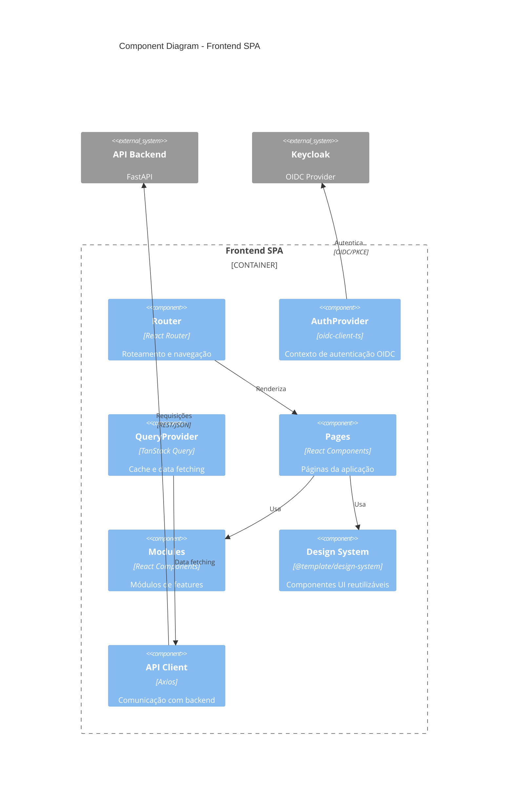
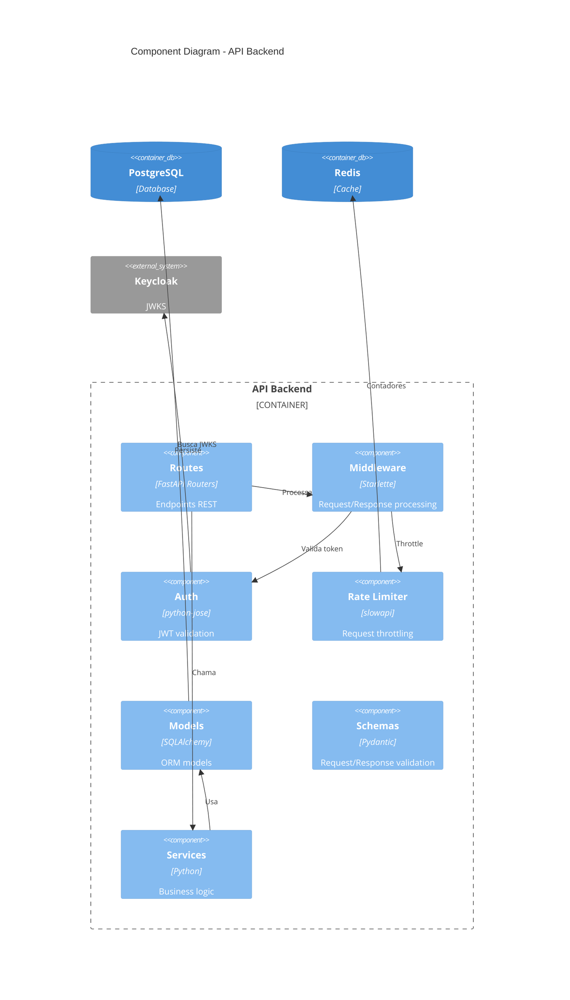
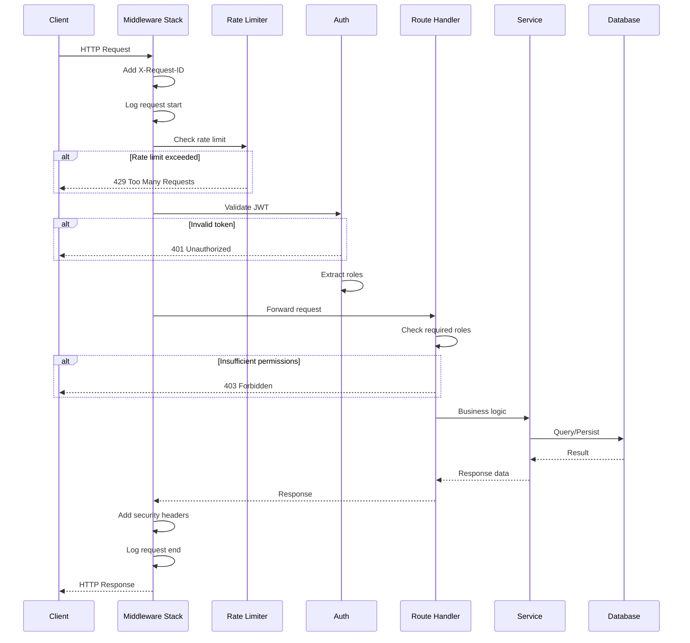

# C4 Model - Nível 3: Component Diagram

> Visão dos componentes internos dos principais containers.

## Frontend SPA - Components



### Estrutura de Componentes Frontend

```
apps/web/src/
├── components/              # Componentes específicos da app
│   ├── analytics/          # Dashboard de analytics
│   ├── common/             # Loading, ErrorBoundary
│   └── filters/            # FilterSelect, etc.
│
├── pages/                   # Páginas (rotas)
│   ├── HomePage.tsx
│   ├── ProfilePage.tsx
│   ├── ConfigPage.tsx      # Requer role ADMIN
│   └── ...
│
├── modules/                 # Módulos de features
│   ├── etl/                # ETL management
│   ├── users/              # User management
│   └── lgpd/               # LGPD compliance
│
├── hooks/                   # Custom hooks
│   ├── useImageOptimization.ts
│   └── ...
│
├── lib/                     # Utilitários
│   ├── cdn.ts              # CDN integration
│   └── sentry.ts           # Error tracking
│
└── config/                  # Configurações
    └── routes.ts
```

### Packages Compartilhados

```
packages/
├── shared/src/
│   ├── auth/
│   │   ├── AuthContext.tsx      # Provider principal
│   │   ├── oidcConfig.ts        # Configuração OIDC
│   │   ├── types.ts             # UserRole, AuthUser
│   │   └── index.ts             # Exports
│   │
│   ├── api/
│   │   ├── client.ts            # Axios instance configurado
│   │   └── interceptors.ts      # Auth interceptor
│   │
│   ├── cache/
│   │   └── queryClient.ts       # React Query config
│   │
│   └── utils/
│       ├── logger.ts            # Structured logging
│       ├── formatters.ts        # Date, currency, etc.
│       └── helpers.ts           # Utilidades gerais
│
├── design-system/src/
│   ├── components/
│   │   ├── Button/
│   │   ├── Input/
│   │   ├── Modal/
│   │   ├── Card/
│   │   ├── Table/
│   │   └── ...
│   │
│   ├── tokens/
│   │   └── colors.ts, spacing.ts, typography.ts
│   │
│   └── styles/
│       └── base.css
│
└── types/src/
    ├── api.ts                   # API response types
    ├── auth.ts                  # Auth types
    └── common.ts                # Generic types
```

---

## API Backend - Components



### Estrutura de Componentes Backend

```
api-template/app/
├── main.py                  # 🎯 Entry point, app config
├── middleware.py            # RequestLogging, SecurityHeaders
├── logging_config.py        # Structlog configuration
│
├── # === Segurança ===
├── rate_limit.py            # Rate limiting (slowapi)
├── csrf.py                  # CSRF protection
├── security.py              # CSP headers, security config
├── audit.py                 # Audit logging
│
├── # === Multi-tenancy ===
├── tenant.py                # Tenant context, middleware
├── rls.py                   # Row-Level Security
├── session.py               # Redis session store
│
├── # === Features ===
├── analytics.py             # Event tracking
├── websocket.py             # WebSocket support
│
└── # === Database ===
    # [TODO: confirmar] models/ e schemas/ não encontrados
    # Estrutura esperada:
    # ├── models/            # SQLAlchemy models
    # ├── schemas/           # Pydantic schemas
    # └── services/          # Business logic

alembic/
├── env.py                   # Migration environment
├── versions/                # Migration files
└── script.py.mako           # Migration template
```

---

## Fluxo de Request (API)



---

## Decisões de Design

### Frontend

| Decisão                  | Razão                                |
| ------------------------ | ------------------------------------ |
| Context API para Auth    | Simples, suficiente para auth global |
| TanStack Query para data | Cache automático, refetch, mutations |
| Workspace packages       | Reutilização, versionamento único    |
| Tailwind + Design Tokens | Consistência, customização fácil     |

### Backend

| Decisão        | Razão                              |
| -------------- | ---------------------------------- |
| FastAPI        | Async, tipagem, OpenAPI automático |
| Pydantic v2    | Validação rápida, coerção de tipos |
| SQLAlchemy 2.0 | Async support, type hints          |
| Structlog      | Logs estruturados, JSON em prod    |

---

**Referências:**

- [C4 Model](https://c4model.com/)
- [Mermaid C4](https://mermaid.js.org/syntax/c4.html)
